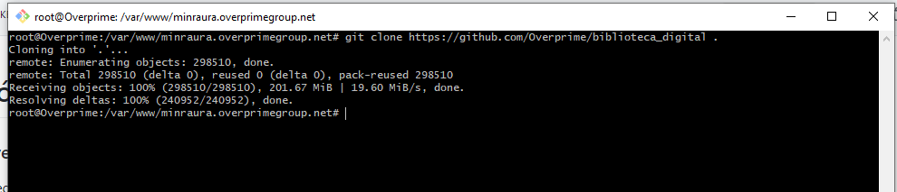

Creación Proyecto Wordpress
======

### Clonar Proyecto desde Github ( https://github.com/Overprime/biblioteca_digital )

Ingresar a carpeta donde se encuentra el proyecto
```bash
cd /var/www/mincondestable.overprimegroup.net
```

Clonar dentro del proyecto(el punto al final significa que se copiará en la carpeta actual)
```bash
git clone https://github.com/Overprime/biblioteca_digital .
```



Luego dar permisos de escritura y lectura
```bash
sudo chown -R www-data:www-data  minraura.overprimegroup.net
sudo chmod 755 -R   minraura.overprimegroup.net
```

### Clonar Base de datos
Ingresar al administrador de base de datos  https://overprimegroup.net/phpmyadmin/ para clonar la base de datos:

* Seleccionar la base de datos **biblioteca_mincondestable** ir a la opcion operaciones y Copiar Base de Datos ingresando el nombre de la base de datos en este ejemplo **biblioteca_minraura**


## Actualizar Configuración 

Ingrese al proyecto
```bash
cd /var/www/minraura.overprimegroup.net
```

Edite el archivo de configuración
``php
nano nano wp-config.php
``

Dentro del archivo ubique esta línea y modifiquelo por la base de datos de su proyecto actual
``php
define( 'DB_NAME', 'biblioteca_mincondestable' );
```

Quedaría asi:
``php
define( 'DB_NAME', 'biblioteca_mincondestable' );
``


